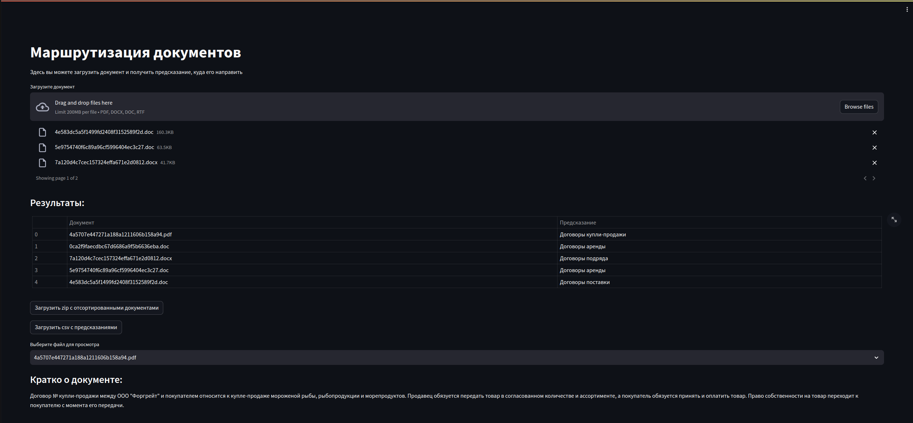
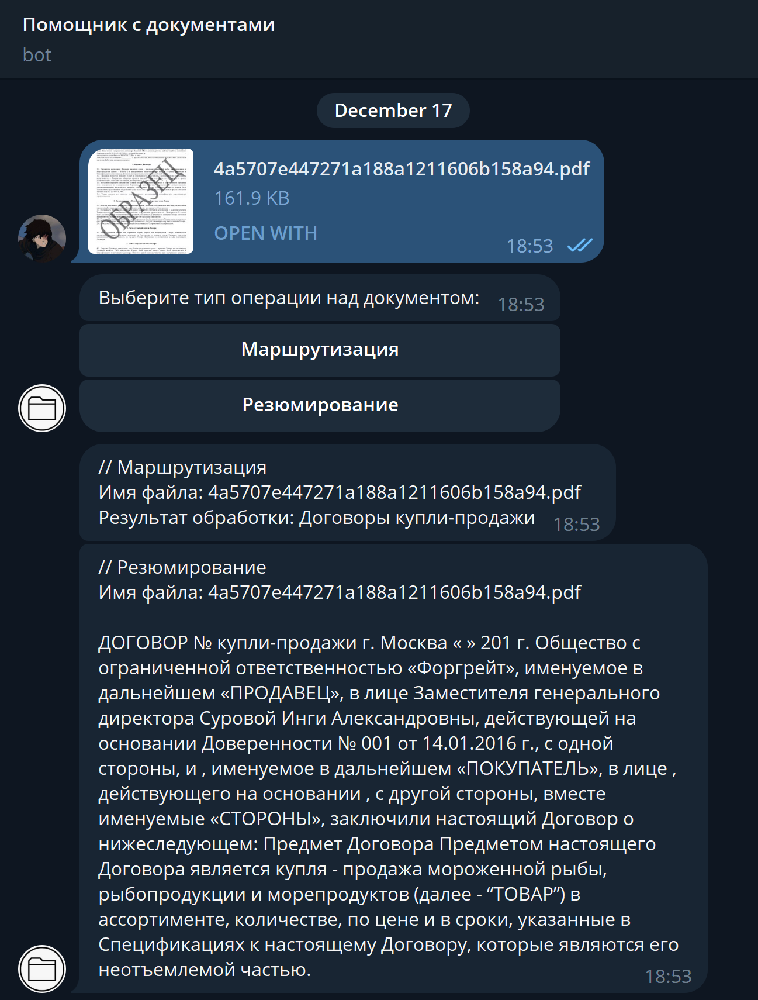

# My final project

## Overview

Task is to create web-service to sort documents by type of contract. \
Also we need to interpret the contract and extract some information from it.

## Methods

I have created web-service with streamlit. \
But also I have created simple telegram bot.

I used 2 methods to solve this task:

1. Classification using ruBert - accuracy 0.73 on test data (mean)
2. Summarization using GPT

You could find unrealized methods in some notebooks in the `notebooks` folder.

## How it looks like

### Web-service



### Telegram bot (now not active)



## Setup environment

### Linux/macOS

```bash
python3 -m venv venv/ 
venv/bin/activate
pip install poetry
poetry install
```

### Windows

```bash
python -m venv venv/
venv/Scripts/activate
pip install poetry
poetry install
```

Also install `model_weights` from
this [url](https://drive.google.com/uc?export=download&id=1a8r-Xj0b3xIQ-UlpzMACmsqgR9ecKHz5)
and extract it to `model_weights/` folder in the root folder.

## Run code

You should create .env in root folder and add your OPENAI_API_KEY to it.

```.env
OPENAI_API_KEY=<YOUR_OPENAI_API_KEY>
```

### Telegram Bot

Also add telegram bot token to .env

```.env
API_KEY=<YOUR_TELEGRAM_BOT_TOKEN>
```

and then run

```bash
python telegram_app.py
```

### Streamlit App

```bash
streamlit run streamlit_app.py
```
